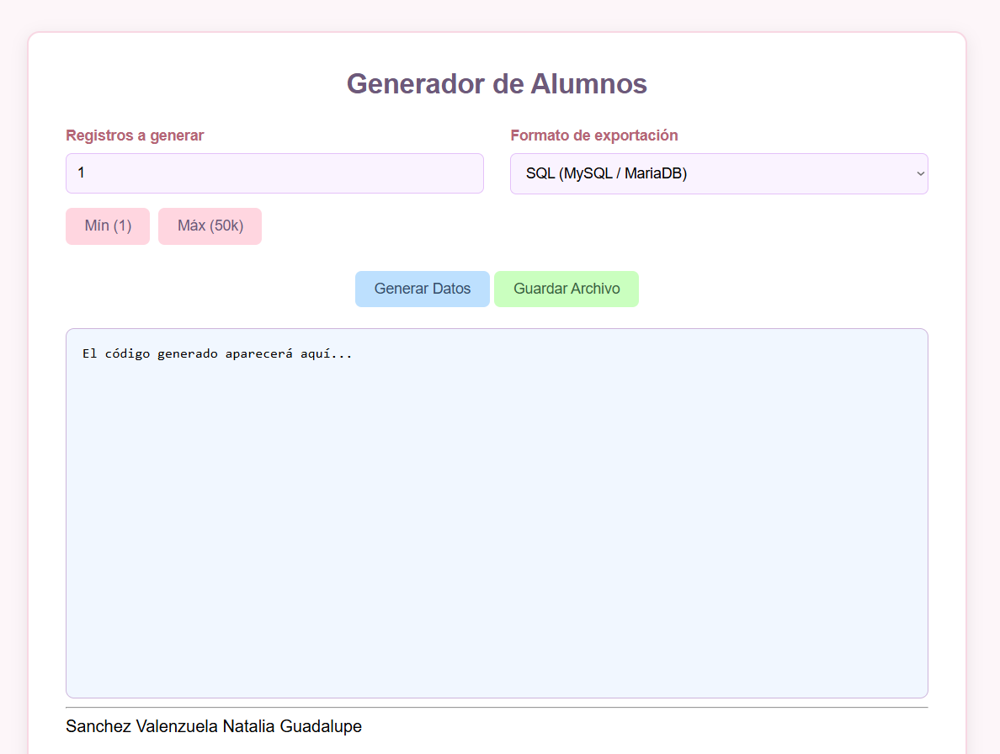
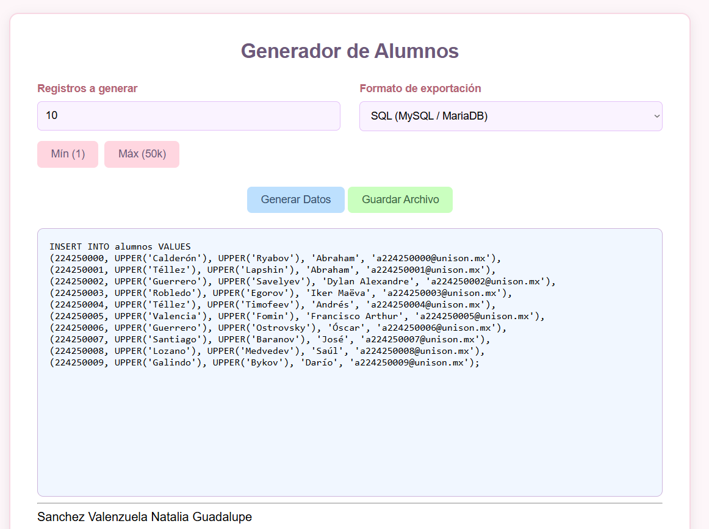
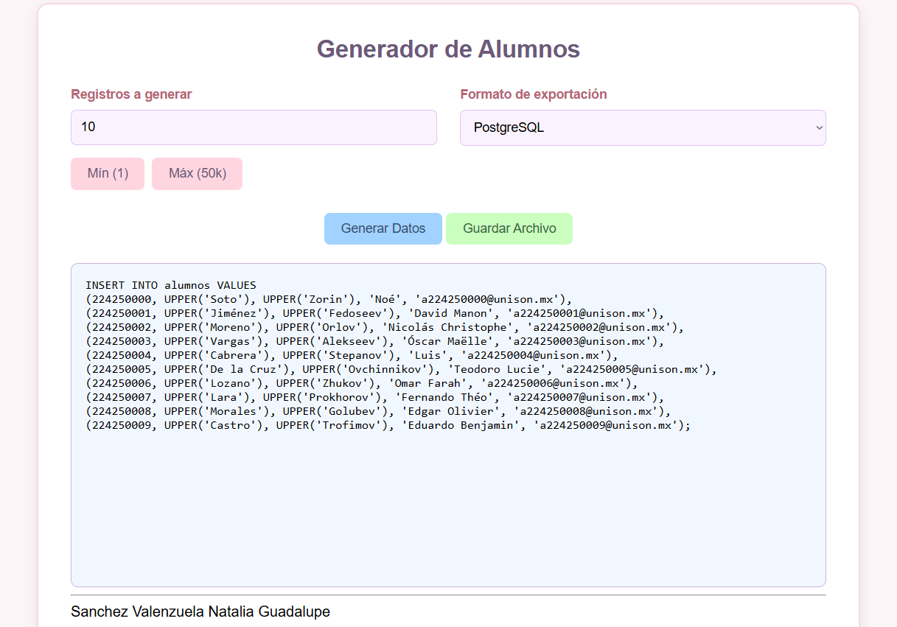
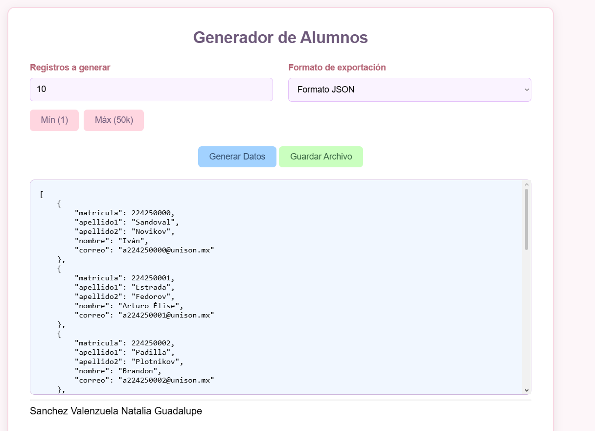
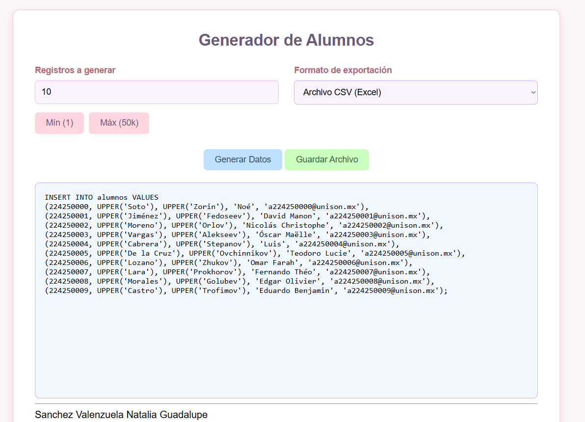
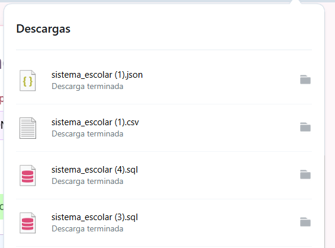

  

<h1 align="center">
  
</h1>

<b>Herramienta de Data Seeding y Generación Sintética | Universidad de Sonora</b>

 

<b>Creador y Modalidad</b>

* **Estudiante:** Natalia Valenzuela ([@NataliaVlza](https://github.com/NataliaVlza))
* **Institución:** Universidad de Sonora (UNISON) - Facultad Interdisciplinaria de Ingenierías
* **Modalidad:** Proyecto guiado y desarrollado en sesiones prácticas de laboratorio.
* **Contacto:** natalia28valenzuela@gmail.com
* **Ubicación:** Hermosillo, Sonora, México

 

<b>Descripción del Proyecto</b>

Aplicación web / herramienta interactiva diseñada para la generación masiva de registros sintéticos de alumnos para bases de datos relacionales y no relacionales. Permite parametrizar el número de datos a generar (desde 1 hasta 50,000 registros) y exportarlos en múltiples formatos para facilitar la carga inicial de datos (<i>data seeding</i>) en proyectos académicos o de desarrollo.

<b>Funcionalidades y Requisitos Implementados:</b>

* **Generación Parametrizada:** Selector de cantidad de registros con botones de ajuste rápido (*Mín: 1*, *Máx: 50k*).
* **Múltiples Formatos de Exportación:** Soporte para sentencias `INSERT` en **SQL (MySQL / MariaDB)**, **PostgreSQL**, así como estructuras en **JSON** y **CSV (Excel)**.
* **Formateo de Datos:** Generación automática de matrículas, nombres, apellidos formateados en mayúsculas (`UPPER`) y direcciones de correo institucional (`@unison.mx`).
* **Descarga Directa:** Opción para previsualizar el código generado en pantalla y guardar directamente el archivo resultante en el equipo local.

 

<b>Imágenes del Proyecto</b>

<b>1. Pantalla de Inicio</b> 
Interfaz principal del sistema que permite configurar el volumen de datos a generar y seleccionar el motor o formato de exportación deseado.

 

<b>2. Generación en SQL (MySQL / MariaDB)</b> 
Vista previa de la sintaxis de inserción generada en formato compatible con MySQL y MariaDB.

 

<b>3. Generación en PostgreSQL</b> 
Construcción de sentencias de inserción adaptadas para la sintaxis de PostgreSQL.

 

<b>4. Generación en Formato JSON</b> 
Estructuración de los datos sintéticos de alumnos en formato de objetos JSON para aplicaciones no relacionales o consumo de APIs.

 

<b>5. Generación en Formato CSV (Excel)</b> 
Formateo de la información delimitada por comas lista para su importación en hojas de cálculo como Excel.

 

<b>6. Archivos Generados y Descargados</b> 
Muestra de los diferentes archivos descargados (.json, .csv, .sql) listos para ser utilizados en los gestores de bases de datos.

 

Créditos de componentes visuales: <a href="https://github.com/kyechan99/capsule-render/blob/main/docs/README_es.md">capsule-render</a> por @kyechan99 y <a href="https://github.com/denvercoder1">readme-typing-svg</a> por @DenverCoder1

  

